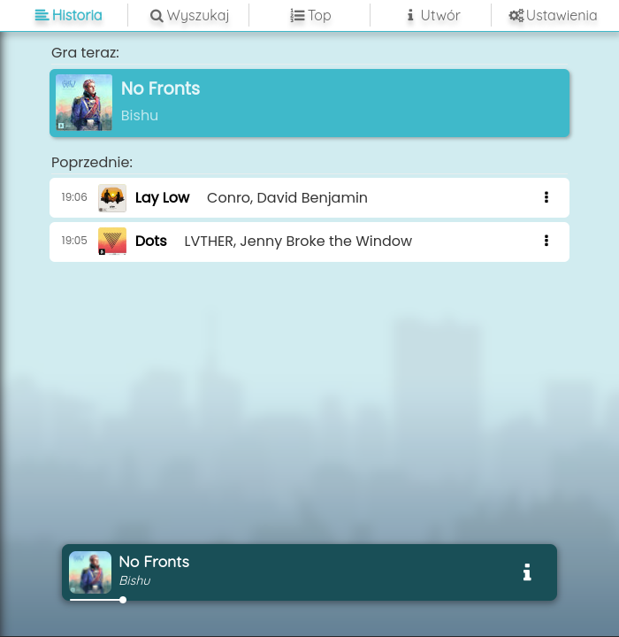
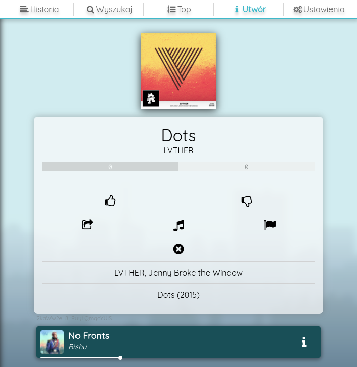

# radio-rolnik

<p float="left">
  
   
</p>


## Resources

API - [Maathias/radio-rolnik-api/](https://github.com/Maathias/radio-rolnik-api/)

Player - [Maathias/radio-rolnik-player/](https://github.com/Maathias/radio-rolnik-player/)

## .env

```ini
REACT_APP_WS_SERVER=wss://radio.rolniknysa.pl/ws/
REACT_APP_DOMAIN=radio.rolniknysa.pl
REACT_APP_NAME=radio-rolnik

REACT_APP_FB_REDIRECTURI=https://radio.rolniknysa.pl/api/login/token
```

## Usage

`yarn start` for develompent server

`yarn build` for production build
